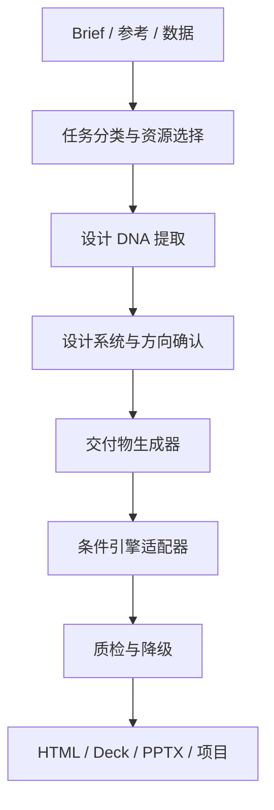

# Design Master 资源研究报告

核验日期：2026-07-19  
目标仓库：[Guojiz/Design_Master-skill](https://github.com/Guojiz/Design_Master-skill)  
阶段：资源调查与能力拼装基线（编码前）

## 目录

- [1. 结论先行](#1-结论先行)
- [2. 调查方法与版本口径](#2-调查方法与版本口径)
- [3. Claude Design 与 Open Design](#3-claude-design-与-open-design)
- [4. 六个开源 Skill 源码审计](#4-六个开源-skill-源码审计)
- [5. 能力重叠与去重结论](#5-能力重叠与去重结论)
- [6. 前端引擎接入结论](#6-前端引擎接入结论)
- [7. 设计资源库](#7-设计资源库)
- [8. 统一插件架构](#8-统一插件架构)
- [9. 许可证与再发布边界](#9-许可证与再发布边界)
- [10. 实施顺序](#10-实施顺序)

## 1. 结论先行

Design Master 不应成为另一个巨型页面生成器。正确形态是一个薄编排层：先选参考资源，提炼可执行设计系统，再按交付物类型选择 HTML、演示、数据、动效或 3D 能力，最后统一质检与导出。

首版采用以下分工：

| 能力 | 主实现来源 | 接入方式 |
|---|---|---|
| 参考拆解与视觉方向 | huashu-design + taste-skill | 清洁重写工作流与检查规则 |
| HTML 演示 | frontend-slides + html-ppt-skill | 自研统一舞台与运行时；上游作为可选模板包 |
| 设计知识库 | ui-ux-pro-max-skill | 外部适配优先；只固化必要的查询接口 |
| 杂志 / 瑞士演示 | guizang-ppt-skill | 仅外部调用或清洁复现概念，不复制当前源码 |
| 开源设计工作台 | Open Design | 可选 MCP / CLI 后端，不内嵌其大型仓库 |
| 闭源设计工作台 | Claude Design | 可选外部 MCP 与导入导出路径 |
| 图表 | ECharts | 条件调用 |
| 动效 | GSAP | 条件调用，并提供 reduced-motion 降级 |
| 3D 快速场景 | Spline | 用户提供场景 URL / 导出物后嵌入 |
| 3D 自定义场景 | Three.js | 仅在低层控制确有必要时调用 |
| 自动审美与 UX 审查 | taste-skill + ui-ux-pro-max-skill | 统一为可执行质量门 |

两个关键法律结论：

1. `op7418/guizang-ppt-skill` 当前根许可证为 AGPL-3.0，不能把其当前源码复制进本 MIT 仓库后以 MIT 再发布。
2. `@splinetool/runtime` 与 `@splinetool/viewer` 的 npm 元数据未声明许可证；首版不分发其代码，只接收用户自己从 Spline 导出的 URL、viewer 或项目资源。

## 2. 调查方法与版本口径

本报告不是链接收藏。对每个仓库执行了浅克隆，读取根目录树、README、SKILL.md、许可证、清单、脚本、模板与关键运行时代码；版本同时记录“用户可识别的发布版本”和“本次实际阅读的提交快照”。

版本口径：

- 有稳定 tag 时，记录 tag；若主分支已经领先 tag，则仍以审计 SHA 固定本次结论。
- 没有 tag 时，版本标记为 `unversioned@<short-sha>`。
- 仓库内多个清单数字不一致时，以运行时代码或主插件清单为主，并明确标出漂移。
- 所有动态产品与 npm 版本均以 2026-07-19 的官方页面或注册表结果为准。

机器可读的固定版本见 [`UPSTREAMS.lock.json`](./UPSTREAMS.lock.json)。

## 3. Claude Design 与 Open Design

### 3.1 Claude Design

| 检查项 | 结论 |
|---|---|
| 安装方式 | Claude 网页版 / 桌面版中的研究预览；与 Claude Code 连接时可添加官方 HTTP MCP：`claude mcp add --scope user --transport http claude-design https://api.anthropic.com/v1/design/mcp`，随后执行 `/design-login`。 |
| 是否开源 | 否。它是 Anthropic 的闭源产品，不可作为本仓库的可再发布依赖。 |
| 支持模型 | 官方发布说明称由 Claude Opus 4.7 驱动；没有开放任意模型路由。 |
| 输入 | 自然语言、图片 / 截图、DOCX、PPTX、XLSX、代码库、设计文件 / 资产及网页捕获。受登录、站点权限和抓取限制影响的 URL 不保证可读取。 |
| 输出 | 可交互设计、独立 HTML、ZIP、PDF、PPTX、Canva 交付，以及交接到 Claude Code。 |
| 读取 URL / 截图 / HTML | 截图与网页捕获：是；代码库与 HTML 交接：是。任意 URL 的可访问性依赖网页权限。 |
| Skill / 扩展 | 没有找到“在 Claude Design 内安装任意 Skill”的公开接口。官方扩展路径是设计系统同步、Claude Code、MCP 与连接器。 |
| 完整项目导出 | 能导出独立 HTML / ZIP，并可交给 Claude Code 继续工程化；不应假设每个产物都是现成框架项目。 |

官方依据：[Anthropic 发布说明](https://www.anthropic.com/news/claude-design-anthropic-labs)、[入门文档](https://support.claude.com/en/articles/14604416-get-started-with-claude-design)、[设计系统设置](https://support.claude.com/en/articles/14604397-set-up-your-design-system-in-claude-design)。

接入决定：只实现 `claude-design` 外部适配器与交付约定，不复制产品能力。Design Master 的中间产物必须保持工具中立：`design-system.md + tokens.json + artifact source`。

### 3.2 Open Design

审计仓库：[nexu-io/open-design](https://github.com/nexu-io/open-design)  
版本：`open-design-v0.15.1`；审计主分支快照 `6b90486c97967633bfcfb0cd4d3c9b3314bf0caf`。根 `package.json` 为 `0.15.1`；README 顶部仍有旧版 `0.13.0` 宣传语，属于文档漂移。

| 检查项 | 结论 |
|---|---|
| 安装方式 | 桌面应用；或源码安装：Node `~24`、pnpm `10.33.2`，`pnpm install` 后运行开发工具；安装 MCP 使用 `od mcp install <agent>`。 |
| 是否开源 | 是，根仓库 Apache-2.0；捆绑 Skill / 模板保留各自许可证。 |
| 支持模型 | 25 类本地编码 Agent；BYOK 覆盖 OpenAI、Anthropic、Azure OpenAI、Google、Ollama 与任意 OpenAI-compatible endpoint；另有 Open Design Cloud。 |
| 输入 | 自然语言 brief、代码仓库、`DESIGN.md`、截图、URL、Figma / Claude Design 导入，以及本地项目文件。 |
| 输出 | 实际 HTML/CSS 源码、HTML、PDF、PPTX、ZIP、Markdown、MP4；文件系统 Agent 可输出完整项目文件。 |
| 读取 URL / 截图 / HTML | 是；README 明确描述截图 / URL 建立设计系统、HTML 预览及源码下载。 |
| Skill / 扩展 | 是；功能 Skill、渲染模板、设计系统和插件四层可组合，并提供 MCP。 |
| 完整项目导出 | 是；文件系统模式写入规范项目文件，MCP 暴露实时 tokens、JSX 与 HTML。 |

官方依据：[Open Design 仓库](https://github.com/nexu-io/open-design)。

接入决定：把 Open Design 当作可选工作台 / MCP 后端，而不是复制其大体量 monorepo。Design Master 负责更清晰的资源选择、设计 DNA 中间格式、引擎选择和质量门；Open Design 负责可选的预览、编辑和多格式导出。

## 4. 六个开源 Skill 源码审计

### 4.1 总览

| 项目 | 真实仓库 | 版本 / 审计快照 | 许可证 | 直接整合 |
|---|---|---|---|---|
| frontend-slides | [zarazhangrui/frontend-slides](https://github.com/zarazhangrui/frontend-slides) | 插件 `2.1.0`; `9906a34d640d…` | MIT | 是，需保留归属 |
| huashu-design | [alchaincyf/huashu-design](https://github.com/alchaincyf/huashu-design) | `v2.0` 后主分支; `32cc58127f60…` | MIT | 是，模块化吸收 |
| guizang-ppt-skill | [op7418/guizang-ppt-skill](https://github.com/op7418/guizang-ppt-skill) | `v1.1.0` 后主分支; `82fe5ae129e8…` | AGPL-3.0 | 否；外部适配 / 清洁复现 |
| html-ppt-skill | [lewislulu/html-ppt-skill](https://github.com/lewislulu/html-ppt-skill) | 无 tag; `f3a8435d3901…` | MIT | 是，需保留归属 |
| taste-skill | [Leonxlnx/taste-skill](https://github.com/Leonxlnx/taste-skill) | 清单 `1.0.0`，默认 Skill 为 v2 实验版; `7c397f22d3af…` | MIT | 是，作为审查层 |
| ui-ux-pro-max-skill | [nextlevelbuilder/ui-ux-pro-max-skill](https://github.com/nextlevelbuilder/ui-ux-pro-max-skill) | Skill `2.11.0`; CLI `2.5.0`; `f8ac5e1266db…` | MIT | 是，优先适配而非整库复制 |

### 4.2 frontend-slides

- **项目名称**：frontend-slides
- **GitHub 地址**：<https://github.com/zarazhangrui/frontend-slides>
- **许可证**：MIT。
- **安装方式**：Claude Code marketplace / plugin；也可把根 `SKILL.md` 与配套资源作为 Skill 使用。
- **依赖环境**：生成的演示可零构建运行；PPTX 读取脚本需要 Python 与 `python-pptx`；PDF 导出脚本临时使用 Node + Playwright；部署脚本可选 Vercel。
- **Skill 结构**：根 Skill 与插件内 Skill 镜像；引用 `viewport-base.css`、`html-template.md`、动画规则、样式预设、粗体模板包与脚本。
- **提示词结构**：先判断新建 / PPT 转换 / 已有 HTML 增强，再确定内容密度；风格未锁定时生成三份实际 HTML 预览，不用抽象形容词让用户猜。
- **模板结构**：固定 1920×1080 画布，按视口等比缩放；安全预设与“粗体模板包”分离，后者用 `selection-index.json → preview.md → design.md` 渐进加载。
- **可复用代码**：PPTX 文本 / 备注抽取、统一舞台、键盘翻页、`contenteditable + localStorage` 轻编辑、Playwright PDF 导出。
- **独特能力**：三种工作模式；先给真实风格预览；模板库渐进披露；转换已有 PPT 时保留叙事结构。
- **重叠部分**：与 html-ppt 的舞台 / 翻页 / 演示功能重叠；与 huashu 的三方向选择重叠。
- **是否适合直接整合**：适合，但不复制整个模板库。首版吸收工作流与舞台契约，模板包保留为可选上游。

### 4.3 huashu-design

- **项目名称**：huashu-design
- **GitHub 地址**：<https://github.com/alchaincyf/huashu-design>
- **许可证**：MIT。仓库历史上曾有个人用途限制，2026-05 已改为 MIT；固定快照必须使用当前许可证。
- **安装方式**：克隆后作为 Agent Skill 使用；运行导出脚本前执行 `npm install`。
- **依赖环境**：`pdf-lib ^1.17.1`、`playwright ^1.59.1`、`pptxgenjs ^4.0.1`、`sharp ^0.34.5`；视频导出还需要 FFmpeg。
- **Skill 结构**：单一总路由 `SKILL.md`，下挂 `references/`、素材、演示样例、导出与验证脚本。
- **提示词结构**：先核对品牌 / 事实 / 素材，再做真实可视化方向选择；当前主分支要求任何新设计都先产出三份方向预览；随后按原型、演示、动效、信息图或审查路由。
- **模板结构**：网页与 App 原型、1920×1080 演示总览、HTML→PPTX、HyperFrames / GSAP 视频管线、设计评审模板。
- **可复用代码**：Playwright 读取 DOM computed style、Sharp 处理图像、PptxGenJS 生成可编辑 PPTX、逐帧确定性视频渲染、导出校验。
- **独特能力**：一句话多类型设计路由；品牌资产协议；三方向真实截图；HTML→可编辑 PPTX；动效视频与音频管线。
- **重叠部分**：三方向与 frontend-slides 重叠；审美门与 taste 重叠；PPT 舞台与两个演示 Skill 重叠。
- **是否适合直接整合**：适合拆成路由、方向门、PPTX 导出和视频导出四个独立能力；不照搬“所有任务一律阻塞三方向”，明确规格或用户要求直出时允许跳过。

### 4.4 guizang-ppt-skill

- **项目名称**：guizang-ppt-skill
- **GitHub 地址**：<https://github.com/op7418/guizang-ppt-skill>
- **许可证**：当前根仓库 AGPL-3.0。
- **安装方式**：克隆或安装 Skill 后使用；浏览器直接打开单文件 HTML；Swiss deck 校验器需要 Node。
- **依赖环境**：浏览器；本地 Motion One 资源；Node 校验脚本。无常规构建步骤。
- **Skill 结构**：根 `SKILL.md` + 主题 / 模板引用 + 素材 + `validate-swiss-deck.mjs`。
- **提示词结构**：先锁视觉系统，再组织章节叙事、页面节奏与配图；分别执行电子杂志 / 水墨系统和瑞士国际主义系统的硬规则。
- **模板结构**：单文件横向翻页；电子杂志系统约 10 类布局；Swiss 系统约 22 个锁定布局；额外覆盖封面与社交媒体比例。
- **可复用代码**：主题化页面结构、章节转场、键盘翻页、Swiss deck 静态校验器。
- **独特能力**：叙事节奏非常强，强调“主题—章节—版式”联动；电子杂志与瑞士视觉系统完成度高。
- **重叠部分**：单文件横向演示与 frontend-slides / html-ppt 重叠。
- **是否适合直接整合**：不适合直接复制进 MIT 仓库。只允许把普遍设计思想清洁重写，或让用户单独安装 AGPL Skill 并通过外部适配器调用。Open Design 内存在带独立 MIT LICENSE 的旧快照，但在来源与授权链未单独核定前不复制。

### 4.5 html-ppt-skill

- **项目名称**：html-ppt-skill
- **GitHub 地址**：<https://github.com/lewislulu/html-ppt-skill>
- **许可证**：MIT。
- **安装方式**：`npx skills add https://github.com/lewislulu/html-ppt-skill`，或克隆后直接打开静态 HTML。
- **依赖环境**：纯静态 HTML / CSS / JS；字体可来自 CDN；PNG / PDF 自动化可选 Chrome、Playwright 或无头浏览器。
- **Skill 结构**：`SKILL.md` 路由到 `assets/`、`references/`、`templates/`、`examples/` 与 `scripts/`。
- **提示词结构**：选择主题、全套模板、单页布局和动画，再按内容密度装配；强调静态可交付与演讲者模式。
- **模板结构**：36 主题、15 套完整 deck、31 页面布局、27 CSS 动画与 20 Canvas 特效；基础 token、主题、布局、特效、运行时彼此分层。
- **可复用代码**：`base.css`、键盘 / 触控翻页、BroadcastChannel / localStorage 跨窗口演讲者同步、当前页 / 下一页 / 讲稿 / 计时器卡片。
- **独特能力**：无构建专业演示；主题与布局组合空间大；可拖拽 / 缩放演讲者控制台。
- **重叠部分**：舞台与翻页同 frontend-slides；主题与 Swiss / 杂志风格同 guizang 部分重叠。
- **是否适合直接整合**：适合把 runtime、presenter 和 token 契约作为演示主运行时；模板只按需接入，避免全部常驻上下文。

### 4.6 taste-skill

- **项目名称**：taste-skill
- **GitHub 地址**：<https://github.com/Leonxlnx/taste-skill>
- **许可证**：MIT。
- **安装方式**：克隆 / Skill 安装脚本；默认 Skill 名称为 `design-taste-frontend`。
- **依赖环境**：规则本身无强依赖；图像生成、截图与实现流程按 Agent 能力选择工具。
- **Skill 结构**：默认 v2 实验 Skill、保留 v1，以及 redesign、image-to-code、minimalist、soft、brutalist、stitch、品牌 / 移动端等子 Skill。
- **提示词结构**：先读取现有上下文，建立 design-system map；用 `DESIGN_VARIANCE`、`MOTION_INTENSITY`、`VISUAL_DENSITY` 三个旋钮约束结果；最后做机械化 preflight。
- **模板结构**：不是固定页面模板库，而是多个审美方向、重设计流程和输出约束。
- **可复用代码**：主要价值在检查清单和约束，不在运行时代码。
- **独特能力**：反模板感 / 反 AI 味规则；首屏 fit、CTA 对比、布局重复、动效动机、真实图片等机械检查。
- **重叠部分**：审查与 ui-ux-pro-max 重叠；视觉方向与 huashu 重叠。
- **是否适合直接整合**：适合作为统一质量门，不适合作为主页面生成器。保留旋钮和 preflight 思路，按不同交付物扩展数据页与产品流程检查。

补充核验：另一个同名用途仓库 [senlindesign/taste-skill](https://github.com/senlindesign/taste-skill) 更偏“Design DNA Extractor”，但审计快照没有根 LICENSE 文件，不能复制其内容；仅把“从参考提取设计 DNA”的通用概念纳入自研 schema。

### 4.7 ui-ux-pro-max-skill

- **项目名称**：ui-ux-pro-max-skill
- **GitHub 地址**：<https://github.com/nextlevelbuilder/ui-ux-pro-max-skill>
- **许可证**：MIT。
- **安装方式**：`npm install -g ui-ux-pro-max-cli` 后 `uipro init --ai codex`，或 `npx ui-ux-pro-max-cli init --ai codex`。
- **依赖环境**：查询引擎使用 Python 标准库；CLI 要求 Node，依赖 Commander、Chalk、Ora 与 Prompts。
- **Skill 结构**：`.claude/skills/ui-ux-pro-max/` 内含 SKILL、Python 搜索 / 设计系统脚本、CSV 数据与 stack 规则；仓库另有 CLI 和多 Agent 分发目录。
- **提示词结构**：先 `generate` 全局设计系统，再按 domain 查询风格、配色、字体、图表、UX、动画与技术栈；把 `MASTER.md` 持久化，并允许页面级覆盖。
- **模板结构**：可搜索的本地知识库，不是固定 HTML 模板；当前主插件清单声明 84 风格、192 配色、74 字体组合、25 图表、22 技术栈，并包含 UX、图标与 GSAP 预设。
- **可复用代码**：无第三方 Python 依赖的 BM25 搜索、Markdown / JSON 输出、设计系统生成与持久化、stack 特定规则。
- **独特能力**：把大规模设计知识变成确定性本地检索，而不是把所有规则塞进 prompt。
- **重叠部分**：审查与 taste 重叠；图表 / GSAP 规范与引擎适配器重叠；设计系统与 Open Design 重叠。
- **是否适合直接整合**：适合作为可选本地知识引擎。首版不复制整套数据库，先提供适配器和统一 query contract，避免版本漂移与仓库膨胀。

版本说明：Skill / plugin 清单为 `2.11.0`，npm CLI 包仍为 `2.5.0`；`skill.json` 中部分统计数字滞后，不能把所有清单当成同一版本。

## 5. 能力重叠与去重结论

| 重叠能力 | 不重复保留的实现 | 统一后的唯一职责 |
|---|---|---|
| 1920×1080 舞台、翻页 | 三个演示 Skill 各自一套 | `deck runtime` 只保留一套舞台 / 导航 / 播放协议 |
| 三方向选择 | frontend-slides 与 huashu 各一套 | `direction gate`：开放式任务默认 3 方向；规格明确或用户要求直出时可跳过 |
| 主题 / 模板选择 | 三个演示 Skill 与 Open Design | 统一模板索引，先读轻量元数据，再按选择加载详细模板 |
| 视觉质检 | taste 与 ui-ux-pro-max | taste 负责审美与反模板感；ui-ux-pro-max 负责 UX、无障碍、图表与栈规则 |
| 设计系统 | ui-ux-pro-max 与 Open Design | 统一 `design-system.md + tokens.json`，后端可替换 |
| PPTX 导出 | frontend、huashu、Open Design | 可编辑 PPTX 走 huashu 适配器；截图型 PPTX / PDF 可走 Open Design / Playwright |
| 动效 | 各 Skill 自带 CSS / Motion / GSAP | 统一 motion policy；GSAP 只在叙事或状态需要时启用 |
| 轻编辑 | frontend 与 Open Design | MVP 使用 contenteditable / 侧栏 token 编辑；完整工作台优先交给 Open Design |

## 6. 前端引擎接入结论

### 6.1 版本与许可证

| 引擎 | 2026-07-19 核验版本 | 许可证 / 使用边界 | 首版接入 |
|---|---:|---|---|
| [Apache ECharts](https://echarts.apache.org/) | `6.1.0` | Apache-2.0 | npm / ESM；可直接依赖并保留 NOTICE |
| [GSAP](https://gsap.com/) | `3.15.0` | GreenSock 自定义无收费许可，不是 MIT | npm / ESM；不复制源码，遵循官方条款 |
| [Spline runtime](https://docs.spline.design/exporting-your-scene/web/exporting-as-code) | `1.12.98` | npm 元数据未声明 runtime / viewer 许可证 | 只嵌入用户导出，不再分发 runtime |
| [Three.js](https://threejs.org/) | `0.185.1` / r185 | MIT | npm ESM；按需加载 addons |

GSAP 当前官方说明整套工具可免费使用，包含 ScrollTrigger、SplitText、Flip、MotionPath、Draggable 与 Inertia；“免费”不等于“MIT / 公版”，所以仍按外部依赖处理。[GSAP 授权说明](https://gsap.com/pricing/)

Spline 官方支持 public URL / iframe、`<spline-viewer>`、Vanilla JS / React 代码导出和本地托管 ZIP；某些导出及移除品牌标识受套餐限制。[代码导出](https://docs.spline.design/exporting-your-scene/web/exporting-as-code)、[Spline Viewer](https://docs.spline.design/exporting-your-scene/web/exporting-as-spline-viewer)

### 6.2 自动选择规则

| 条件 | 选择 | 不选择的情况 |
|---|---|---|
| 有真实分类、时间序列、构成或关系数据，图形比表格更清楚 | ECharts | 没有真实数据、只有一个数字、装饰性假图表 |
| 动画用于建立层级、解释状态变化、叙事或章节转场 | GSAP | 动画只为“炫”、内容密度已高、低端设备预算不足 |
| 用户已有 Spline 场景，或产品 3D 展示是核心 | Spline | 没有场景资产、3D 只是背景装饰 |
| 需要自定义 shader、粒子、相机或低层交互 | Three.js | Spline embed 已能完成、2D 更清晰、性能预算不足 |

硬规则：

- 默认不同时启用 Spline 与 Three.js。
- 所有 GSAP / 3D 输出必须提供 `prefers-reduced-motion`、静态 poster 或基础 HTML 降级。
- ECharts 与 GSAP 可以共存，但动画只能解释图表状态或叙事，不能重做 ECharts 自己已具备的过渡。
- 移动端 3D 必须限制 DPR、暂停不可见渲染并设定资源预算。

## 7. 设计资源库

### 7.1 来源索引与去重

| 资源 | 规范 URL | 最适合的任务 | 采集重点 |
|---|---|---|---|
| Awwwards | <https://www.awwwards.com/> | 创意网站、交互、动画 | 页面节奏、交互动机、技术标签 |
| SiteInspire | <https://www.siteinspire.com/> | 极简品牌官网 | 网格、字体、留白、行业筛选 |
| Lapa Ninja | <https://www.lapa.ninja/> | 落地页 | 完整页面结构、CTA、区块顺序 |
| Land-book | <https://land-book.com/> | 落地页、作品集 | 首屏、案例编排、转化路径 |
| Godly | <https://godly.website/> | 科技、实验性网页 | 当前会重定向至 Recent，作为别名而非独立来源 |
| Recent Design | <https://recent.design/> | 新近网页与动效 | 趋势、实验性动效、近期案例 |
| Behance | <https://www.behance.net/> | 品牌、平面、网页、PPT、3D | 项目全过程、品牌系统、成套交付 |
| Dribbble | <https://dribbble.com/> | UI、图标、插画、组件 | 局部组件与视觉语言；不把概念稿当真实 UX |
| Mobbin | <https://mobbin.com/> | 真实 App / Web 产品流程 | 完整流程、状态、平台惯例 |
| Pinterest | <https://www.pinterest.com/> | 情绪板、配色、字体、排版 | 聚类灵感，回溯原始来源 |
| Muzli | <https://muz.li/> | 趋势聚合 | 主题发现与候选来源 |
| Fonts In Use | <https://fontsinuse.com/> | 字体搭配 | 真实场景、字号层级、字体来源 |
| Typewolf | <https://www.typewolf.com/> | 网页字体 | 字体组合、标题 / 正文角色 |
| 站酷 ZCOOL | <https://www.zcool.com.cn/> | 国内品牌、海报、插画 | 国内语境与完整作品集 |
| 优设 UISDC | <https://www.uisdc.com/> | 方法论、趋势、案例、素材 | 方法与教程，核对发布日期 |
| 优设导航 | <https://hao.uisdc.com/> | 工具、字体、配色、图库 | 作为二级导航，不作为原创案例源 |
| UI 中国 | <https://www.ui.cn/> | UI、交互、产品设计 | 中文产品与交互案例 |
| 花瓣网 | <https://huaban.com/> | 图片、海报、版式、情绪板 | 聚类灵感，回溯原创作者 |
| TOPYS | <https://www.topys.cn/> | 品牌、广告、文化、创意 | 创意概念与文化语境 |
| 古田路 9 号 | <https://www.gtn9.com/> | 品牌、包装、平面 | 品牌系统与包装展开 |
| 设计癖 | <https://www.shejipi.com/> | 产品 / 工业设计 | 产品造型、材质、工业设计趋势 |

### 7.2 按项目类型选源

| 项目类型 | 第一组来源 | 第二组来源 | 重点提取 |
|---|---|---|---|
| SaaS / 科技落地页 | Lapa Ninja、Land-book、Recent | Awwwards、SiteInspire | 信息层级、信任证据、CTA、动效克制 |
| 品牌官网 | SiteInspire、Awwwards、Behance | 站酷、古田路 9 号 | 品牌语气、字体、图像艺术指导、页面节奏 |
| App / 产品流程 | Mobbin、UI 中国 | Dribbble、Behance | 真实流程、状态、手势、组件一致性 |
| 演示 / 发布会 | Behance、站酷、TOPYS | Awwwards、Recent | 叙事弧、章节节奏、主视觉、动效 |
| 数据看板 | Mobbin、Behance | ui-ux-pro-max 本地规则 | 指标层级、比较方式、图表选型、异常状态 |
| 字体主导页面 | Fonts In Use、Typewolf | SiteInspire、Pinterest | 字体角色、字重、行长、比例 |
| 3D 产品发布 | Behance、Awwwards、Recent | 设计癖、站酷 | 产品镜头、材质、光照、交互必要性 |
| 国内品牌 / 电商 | 站酷、古田路 9 号、花瓣 | 优设、TOPYS | 中文排版、本地视觉语境、促销信息密度 |

### 7.3 采集协议

1. 根据项目类型选 3–5 个高相关来源，不全站撒网。
2. 收集 3–8 个参考案例，记录 URL、作者、日期、用途与可观察事实。
3. 只提取共通规律：token、网格、层级、组件、图像比例、动效原则和反例。
4. 输出可执行设计系统后才开始制作。
5. 不批量复制作品图片、文案或页面源码；尊重登录、robots、站点条款与作品版权。缓存只保留必要元数据和自有分析。

## 8. 统一插件架构

### 8.1 五层职责

1. **Research**：按项目类型选站点、采集少量案例、记录来源。
2. **Design DNA**：从 URL、截图、图片或 HTML 提取可执行规则。
3. **System**：生成工具中立的 `design-system.md` 与 `tokens.json`，保存页面级 override。
4. **Artifact**：分别处理 responsive page、fixed-stage deck、dashboard、motion 和 3D。
5. **QA / Handoff**：审美、UX、无障碍、响应式、性能、动效降级、编辑与导出。

### 8.2 中间格式

任何后端都必须读写同一套最小契约：

- `research/refs.json`：参考 URL、作者、来源、观察事实、版权状态。
- `design-system.md`：人可读规则。
- `tokens.json`：颜色、字体、间距、圆角、阴影、网格、motion、chart 和 3D 预算。
- `artifact.json`：类型、尺寸模式、页面 / 章节、依赖、数据源、导出目标。
- `qa-report.json`：阻塞问题、警告、已验证项和降级路径。

### 8.3 路由规则

- `page`：响应式布局；内容驱动高度；不套 16:9 舞台。
- `deck`：固定 1920×1080 逻辑画布；等比缩放；键盘 / 触控 / 演讲者模式。
- `dashboard`：响应式网格；真实数据与 ECharts；表格 / 空状态 / 错误状态齐全。
- `motion`：GSAP 时间轴或 CSS；必须有 reduced-motion 和确定性导出路径。
- `3d`：Spline 或 Three.js 二选一；先定义性能预算与静态后备。

### 8.4 轻量编辑器边界

首版编辑层只做：文字点击编辑、图片替换、token 侧栏、页面复制、组件删除、撤销 / 恢复与导出 HTML。拖拽只允许在明确的自由画布 / deck 中使用；响应式网页默认采用网格重排而不是任意坐标拖拽，避免破坏布局。

编辑模式和播放模式必须隔离：所有控件挂在单独 overlay，导出前移除编辑状态，原动画与组件 DOM 不被包裹重写。

## 9. 许可证与再发布边界

| 类别 | 政策 |
|---|---|
| 本仓库原创代码 | MIT |
| MIT / Apache 上游代码片段 | 只有确有必要才复制；保留版权头、许可证和 THIRD_PARTY 记录 |
| AGPL 上游 | 不复制、不改名再发布；外部安装、进程边界调用或清洁复现通用思想 |
| 自定义商业 / 免费许可证 | 作为 npm / CDN 外部依赖使用；不把“免费”描述为“开源” |
| 许可证缺失 | 不复制、不 vendor；仅使用官方嵌入 / 用户导出物 |
| 设计案例 | 记录链接与分析，不批量缓存受版权保护的原图、文案、视频或页面源码 |

进一步规则：

- 每个新增上游都必须写入 `UPSTREAMS.lock.json`：仓库、版本、SHA、许可证、接入模式和审计日期。
- 依赖升级先做许可证 diff，再做行为测试。
- Open Design 根 Apache-2.0 不会自动覆盖其捆绑资源的独立许可证。
- 若未来决定直接组合 AGPL 代码，必须单独评估整个分发物的许可方式，不能在当前 MIT 架构中静默混入。

## 10. 实施顺序

### P0：资源优先基础

1. 固化本报告与上游锁文件。
2. 建立 Design Master Skill 路由和工具中立中间格式。
3. 建立设计资源索引与按项目选源规则。
4. 提供 ECharts、GSAP、Spline、Three.js 的条件调用模板。
5. 提供 page / deck / dashboard 三类生成协议与统一质量门。

### P1：稳定交付

1. 落地 HTML deck runtime、presenter mode 与 PDF 导出。
2. 验证 HTML→可编辑 PPTX 适配器。
3. 实现轻编辑器 MVP。
4. 接入 Open Design MCP / CLI 作为可选工作台。

### P2：复杂媒体

1. Spline 用户场景嵌入。
2. Three.js 自定义 3D 配方与性能预算。
3. GSAP / HyperFrames 视频导出。
4. 自动视觉回归与多视口质检。

本阶段完成标准：报告、锁文件、统一架构和插件骨架通过校验；不以“生成一个普通 HTML 页面”冒充资源整合完成。
